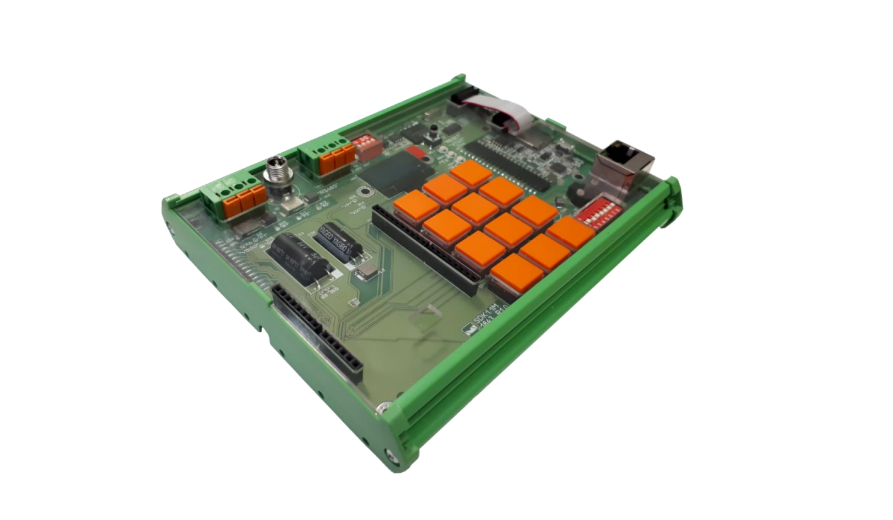

# music_keyboard

Драйвер для воспроизведения музыки на стенде SDK-1.1M.

 

## Описание

Данный драйвер позволяет:

- Воспроизводить ноты (от «до» до «си») текущей октавы с текущей длительностью
  звучания.
- Увеличивать номера текущей октавы (максимальная – пятая).
- Уменьшеньшать номера текущей октавы (минимальная – субконтроктава).
- Увеличивать длительность воспроизведения ноты на 0,1 с.
- Уменьшать длительности воспроизведения ноты на 0,1 с.
- Последовательно воспроизводить все ноты текущей октавы с текущей
  длительностью без пауз.
